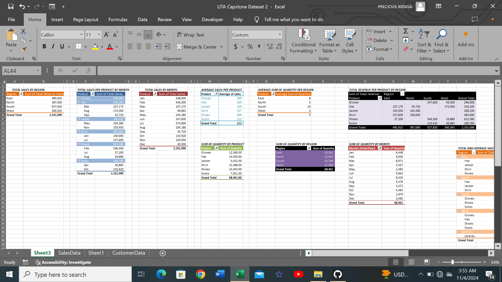
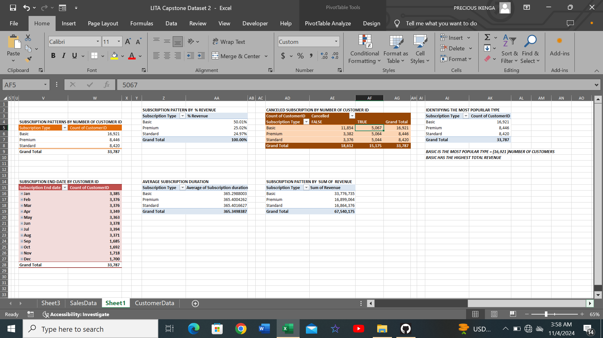
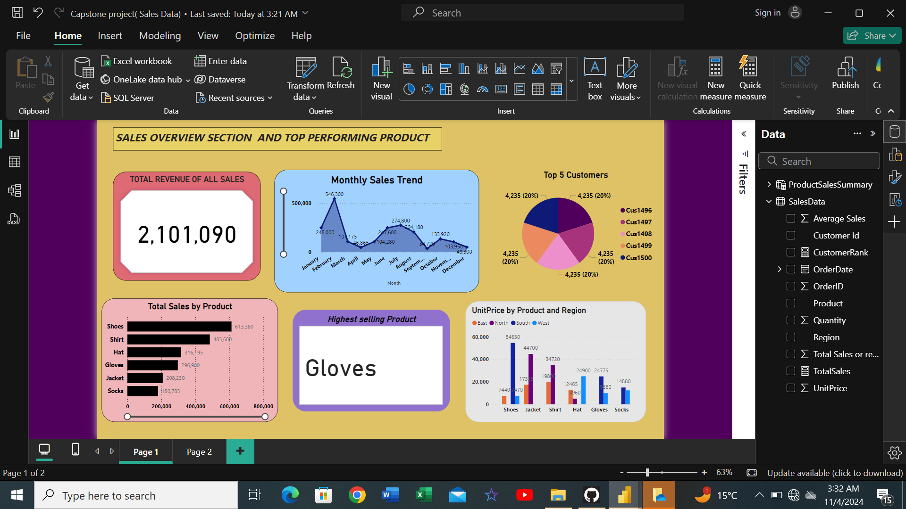
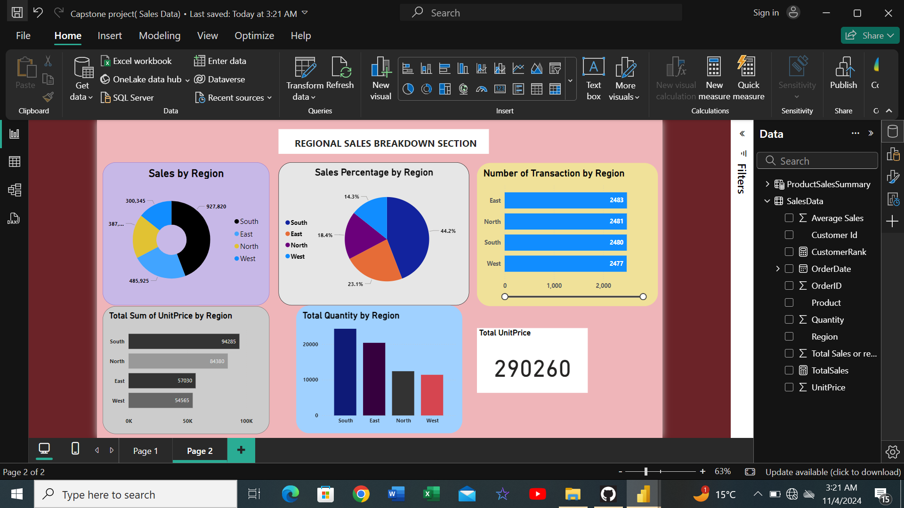
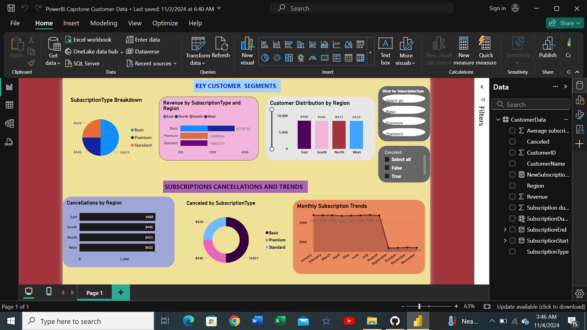

# LITA_Capstone_Project_Documentation
This is where I documented my Capstone project while learning Data Analysis with The Incubator Hub.
## Outline
- [Project Overview](#Project-Overview)

- [Objectives](#Object-ives)
  
- [Dataset Used](#Dataset-Used)
  
- [Project Tools Used](#Project-Tools-Used)

- [Analysis and Key Findings](#Analysis-and-Key-Findings)

- [Insights and Recommendations](#Insights-and-Recommendations)

- [Excel Analysis](#Excel-Analysis)

- [SQL Queries Used](#SQL-Queries-Used)

- [PowerBi Dashboard](#PowerBi-Dashboard)

- [Conclusion](#Con-clusion)

## Project Overview
This project focuses on analysing the sales performance of a retail store to gain useful insights into product performance,customer behaviour, and regional sales distribution. The analysis was executed using [Excel](Excel) for initial data exploration or research, [SQL](SQL) for structured querying, and [PowerBi](PowerBi) for visualizing the results in an interactive dashboard.

## Objectives
1. #### Sales Analysis:
     - Identify Top-selling Products, revenue by region, and monthly sales trends.
     - Determine the percentage contribution of each region and the top customers by revenue.
2. #### Customer Segmentation:
     - Segment customers by subscription type, region, and revenue contribution.
     - Analyse Subscription duration, identify cancellations, and review active in comparison with canceled subscriptions.
  
## Project Tools Used
   - #### Excel:
       For Data cleaning, pivot table analysis, and calculating key metrics.
   - #### SQL:
       To extract insights from the dataset using structured queries.
   - #### PowerBi:
       For creating a dashboard to present the results in a visual and interactive way.

## Dataset Used
1. #### Sales Data:
     which contains details on sales transactions, which includes order dates, products, quantites, unit prices, and regions.
2. #### Customer Data:
     This contains customer demographics and subscription details, such as start and end dates, subscription type, and cancellation status.
### SalesData Table:

| Column Name | Description |
|-------------|-------------|
| **OrderID** | Unique identifier for each sales transaction. |
| **CustomerId** | Customer’s unique identifier. |
| **Product** | The product sold in each transaction. |
| **Region** | The region where the sale occurred. |
| **OrderDate** | Date the order was placed. |
| **Quantity** | Number of units sold in the transaction. |
| **UnitPrice** | Price of each unit sold. |

### CustomerData Table

| Column Name | Description |
|-------------|-------------|
| **CustomerID** | Unique identifier for each customer. |
| **CustomerName** | Name of the customer. |
| **Region** | Customer’s region. |
| **SubscriptionType** | Type of subscription purchased (e.g., Basic, Premium). |
| **SubscriptionStart** | Start date of the subscription. |
| **SubscriptionEnd** | End date of the subscription. |
| **Canceled** | Whether the subscription was canceled (True/False). |
| **Revenue** | Revenue generated from each customer. |

## Analysis and Key Findings
1. #### Top-Selling Products:
    The product with the highest total sales was identified, providing insight into which items contibute the most revenue.
2. #### Regional Sales Distribution:
    The analysis showed which regions contibute the most to overall sales, helping the business prioritize market strategies.
3. #### Customer Segmentation:
    A pie chart was used in PowerBi to visualize the distribution of customers across different subscription types(Basic, Premium, Standard), identifying the most popular types among the 
    customer base and I also used a stacked bar chart in showing revenue contributions across regions and subscriptions types, highlighting high-value segments.
 4. ####  Subscription Trends:
     A line Chart was used in tracking the number of new subscriptions each month, helping to identify peak periods and growth trend. I also did analysis of average subscription duration for 
     each subscription type to understand customer longevity, visualized in a bar chart.
5. #### Customer Cancellations:
    A bar chart was used to illustrate which regions had higher cancellation rates, helping target retention efforts by rates. It also explored where and why customers cancel subscriptions.

## Insights and Recommendations
### Key Insights:

1. #### Top Products:
      Certain products stand out in terms of sales volume, driving most of the revenue. These products have high demand across multiple regions.
2. #### Regional Performance:
      Regions like [South] show strong sales, while others, such as [West], shows low sales, so indicating potential growth areas.
3. #### Customer Value:
      Basic subscribers generate a higher overall revenue, compared to premium or other subscription types, and high-value customers tend to have longer, more stable subscription periods.

### Business Recommendations:
1. #### Boost Sales in Low-Performing Regions:
      Focus marketing and sales efforts on low-performing regions to capture new markets and grow revenue.
2. #### Promote Basic Subscriptions:
      Encourage basic subscribers by adding features specifically for this group, as Basic subscribers generate higher revenue.
3. #### Retain High-Value Customers:
      Implement loyalty programs or personalized discounts to maintain valuable customers, thereby encouraging them to stay subscribed and so reducing cancellation rates.

## Excel Analysis
In Excel, the dataset was first cleaned,and pivot tables were created to summarize total sales by region and product. I also did Basic calculations such as average sales per product and total revenue by region. Below is also a preview of one of the pivot tables showing the sales data:



##### This also a preview of one of the pivot tables showing the customer data:



##### You can also view the full Excel analysis here [LITA Capstone dataset Excel file](Excel/LITACapstoneDataset2.xlsx). click on view raw once you open it.  
    
## SQL Queries Used
SQL was used to extract key insights from dataset, including sales performance, customer behavior, subscription patterns and regional analysis. Below are the key SQL queries used in the analysis:
### 1. Retrieve Total Sales by Product
```sql
SELECT
     Product,
     SUM(Quantity * UnitPrice) AS
total_sales
FROM
    SalesData
GROUP BY
    Product
ORDER BY
    total_sales DESC ;
```
This query calculates the total number of sales by product.
### 2. Retrieve the total number of customers from each region
```sql
SELECT
     Region,
     COUNT(CustomerID) AS
total_customers
FROM
   CustomerData
GROUP BY
    Region;
```
This query calculates the total number of customer from each region. You can find the full set of SQL queries used in this analysis in the [SQL Queries Directory](SQL/)

## PowerBi Dashboard
The insights from the analysis are visualized using a PowerBi. The following are previews of the interactive PowerBi Dashboard I created for this analysis:

### 1. Sales Overview And Top-performing Products



#### This visual shows the total sales distribution by product, customer and region, revealing the top-performing regions, top 5 customers and a breakdown of the products that is generating the highest revenue.

### 2. Regional Sales Breakdown:



#### Different visuals were used in displaying sales across different regions and unit price, indicating which region contribute the most to total revenue.

### 3. Key Customer Segment And Subscription Cancellation/trends:



#### This visuals reveals the total number of customers and their subscription types, shows the subscription patterns which includes the start and end dates, cancellations and monthly trend. Also included in it are slicers for interactive analysis.
#### you can download the full PowerBi Sales Data report here [PowerBi visuals for Analysis](PowerBi/Capstoneproject(SalesData).pbix)
AND
#### you can download the full PowerBi Customer Data report here [PowerBi visuals for Analysis](PowerBi/PowerBiCapstoneCustomerData.pbix)


## Conclusion
Through this analysis I was able to identify key drivers of revenue, such as the top-selling products and regions with highest sales. Additionally, I discovered customer behavior which provided me with valuable information for customer retention and subscription management strategies.


